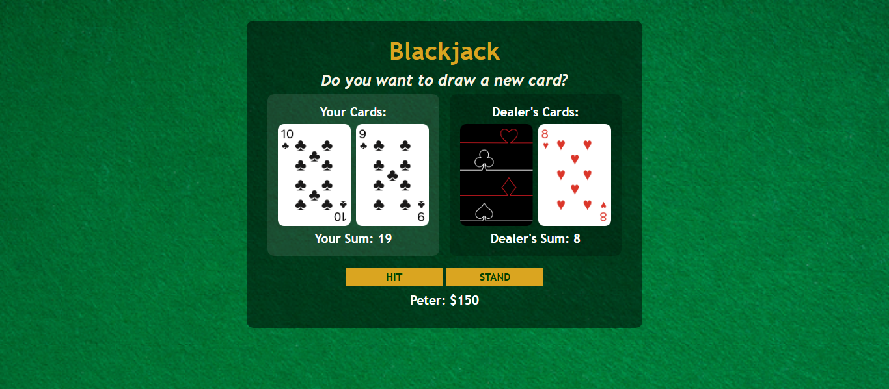

# 🎰 Blackjack Game

## Description

This project is a browser-based Blackjack game. It allows users to play against a dealer, draw cards, stand, and manage their chip balance.

The game was built using HTML, CSS, and JavaScript, focusing on DOM manipulation, game logic, and interactive UI updates.

This task was completed as part of the [Scrimba The Fullstack Developer Path](https://scrimba.com/c0fullstack)

---

### Screenshot

---

### Links

- Solution URL: [GitHub](https://github.com/artemkotko14/blackjack-game)
- Live Site URL: [Webpage](https://artemkotko14.github.io/blackjack-game/)

---

## How to Play

These are the exact rules implemented in this version of Blackjack:

### Objective

The goal is to get a hand value as close to 21 as possible without going over.

### Card Values

- Number cards (2–10) are worth their face value
- Face cards (Jack, Queen, King) are worth 10
- Ace counts as 11 by default, but automatically becomes 1 if the total exceeds 21

### Game Start

- The player enters their name and starts the game
- Both player and dealer receive two cards
- The dealer shows one card, while the other remains hidden

### Player Actions

- Hit → Draw a new card
- Stand → End turn and reveal dealer’s cards

### Player Outcomes

- If total is less than 21 → player can continue
- If total is exactly 21 with 2 cards → Blackjack
  Player instantly wins +100 chips
- If total is 21 with more than 2 cards → must stand
- If total is over 21 → player loses −50 chips

### Dealer Rules

- Dealer reveals hidden card after player stands
- Dealer continues drawing cards while total is less than 17
- Dealer stops at 17 or higher

### Round Results

- Dealer busts (>21) → player wins +50 chips
- Dealer has higher total → player loses −50 chips
- Player has higher total → player wins +50 chips
- Equal totals → tie (no chips lost or gained)
- If dealer gets Blackjack (21 with 2 cards) → player loses −50 chips

### Game Over

If player’s chips reach 0 or below:

- Game ends
- Player must restart

---

## Features

- Start game with player name input
- Deal cards to player and dealer
- Hit (draw new card) functionality
- Stand (end turn and trigger dealer play)
- Dealer logic (draws until 17 or higher)
- Blackjack detection (player and dealer)
- Dynamic Ace handling (11 → 1 when needed)
- Chip balance system (win/lose conditions)
- Game over state when balance reaches 0
- Restart game functionality
- Card images rendered dynamically
- Hidden dealer card until player stands
- Clean UI with separated player and dealer areas
- Reusable functions for cleaner game logic

---

## Technologies Used

- HTML5
- CSS3
- Flexbox
- JavaScript

## Future Improvements

- Add betting system (custom bet amount)
- Add multiple decks (casino-style gameplay)
- Implement card dealing animations
- Add sound effects (card draw, win/lose)
- Improve UI/UX (highlight active player/dealer)
- Add game history or statistics
- Add keyboard controls
- Refactor code into smaller modules

## Author

- Github - [Artem Kotko](https://github.com/artemkotko14)

---
